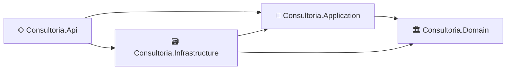
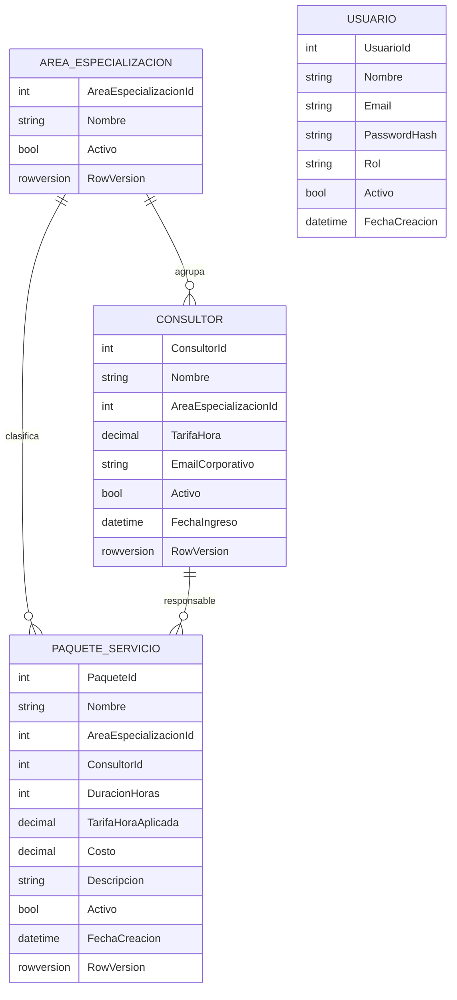
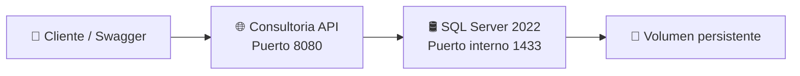

<div align="center">

# 💼 Consultoria API

### Backend empresarial para gestión de consultores, paquetes de servicio, autenticación y reportes administrativos

<p>
  <a href="README.md">
    
  </a>
  <a href="README.es.md">
    
  </a>
</p>

<p>
  
  
  
  
  
  
</p>

</div>

---

## ⭐ Capacidades técnicas 

<table>
  <tr>
    <td width="50%" valign="top">
      <ul>
        <li>✅ Clean Architecture con dirección estricta de dependencias</li>
        <li>✅ Entidades de dominio con comportamiento encapsulado</li>
        <li>✅ Autenticación JWT y autorización basada en roles</li>
        <li>✅ FluentValidation y manejo global de errores con ProblemDetails</li>
        <li>✅ Migraciones, configuraciones, proyecciones y repositorios con EF Core</li>
        <li>✅ Concurrencia optimista con <code>rowversion</code> de SQL Server</li>
      </ul>
    </td>
    <td width="50%" valign="top">
      <ul>
        <li>✅ Pruebas unitarias de dominio y servicios de aplicación</li>
        <li>✅ Pruebas de integración con WebApplicationFactory y Testcontainers</li>
        <li>✅ SQL Server temporal y aislado para el ambiente Testing</li>
        <li>✅ Docker multi-stage y orquestación con Docker Compose</li>
        <li>✅ Health checks de liveness y readiness</li>
        <li>✅ CI con GitHub Actions para build y pruebas automáticas</li>
      </ul>
    </td>
  </tr>
</table>

### Tecnologías demostradas

`C#` · `.NET 10` · `ASP.NET Core Web API` · `Entity Framework Core` · `SQL Server 2022` · `JWT Bearer` · `FluentValidation` · `xUnit` · `Moq` · `WebApplicationFactory` · `Testcontainers` · `Docker` · `Docker Compose` · `GitHub Actions` · `OpenAPI / Swagger`

---

## 👋 Sobre el proyecto

**Consultoria API** es una API REST orientada a la administración de una empresa de consultoría.

Permite gestionar áreas de especialización, consultores, paquetes de servicio, usuarios, autenticación por roles y reportes administrativos. Fue construida como proyecto profesional de portafolio para demostrar prácticas utilizadas en aplicaciones empresariales: separación de responsabilidades, reglas de negocio, seguridad, consistencia de datos, pruebas automatizadas, contenedores e integración continua.

<table>
  <tr>
    <td width="50%">
      <h3>🎯 Enfoque técnico</h3>
      <ul>
        <li>Diseño de APIs REST</li>
        <li>Clean Architecture</li>
        <li>Seguridad con JWT</li>
        <li>Persistencia relacional</li>
        <li>Pruebas automatizadas</li>
        <li>Ambientes con contenedores</li>
      </ul>
    </td>
    <td width="50%">
      <h3>🏢 Enfoque de negocio</h3>
      <ul>
        <li>Administración de consultores</li>
        <li>Tarifas por hora</li>
        <li>Servicios calculados automáticamente</li>
        <li>Control de estados activos e inactivos</li>
        <li>Reportes de facturación</li>
        <li>Preservación de tarifas históricas</li>
      </ul>
    </td>
  </tr>
</table>

---

## 🧰 Stack tecnológico

| Área | Tecnología | Uso dentro del proyecto |
|---|---|---|
| ⚙️ Backend | **C# / .NET 10** | API REST, casos de uso y reglas de negocio |
| 🌐 API | **ASP.NET Core Web API** | Controllers, middleware, autenticación y endpoints |
| 🗃️ Persistencia | **Entity Framework Core** | Mapeo, consultas, migraciones y acceso a datos |
| 🛢️ Base de datos | **SQL Server 2022** | Almacenamiento relacional, restricciones, índices y `rowversion` |
| 🔐 Seguridad | **JWT Bearer** | Autenticación y autorización por roles |
| ✅ Validación | **FluentValidation** | Validación de solicitudes antes de ejecutar casos de uso |
| 📚 Documentación | **OpenAPI / Swagger UI** | Exploración y prueba interactiva de endpoints |
| 🧩 Patrones | **Repository + Service Layer** | Separación entre persistencia y lógica de aplicación |
| ⚡ Rendimiento | **Paginación, proyecciones, AsNoTracking y caché** | Consultas de lectura y reportes más eficientes |
| 📝 Logging | **ILogger** | Logs estructurados de operaciones importantes |
| 🧪 Pruebas unitarias | **xUnit + Moq** | Verificación de dominio y servicios |
| 🔗 Pruebas de integración | **WebApplicationFactory + Testcontainers** | Flujos HTTP con SQL Server temporal real |
| 🐳 Contenedores | **Docker + Docker Compose** | Ambientes reproducibles de API y base de datos |
| 🔄 Integración continua | **GitHub Actions** | Restore, build y pruebas automáticas |

---

## 🏛️ Arquitectura

La solución utiliza **Clean Architecture**, manteniendo las reglas de negocio independientes de ASP.NET Core, Entity Framework Core, SQL Server y otros detalles de infraestructura.



| Capa | Responsabilidad | Elementos principales |
|---|---|---|
| 🏛️ **Domain** | Núcleo de negocio independiente | Entidades, invariantes, cálculos y comportamiento |
| 🧠 **Application** | Casos de uso y contratos | DTOs, interfaces, servicios, validadores y excepciones |
| 🗃️ **Infrastructure** | Implementación técnica | EF Core, repositorios, migraciones, JWT, caché, hashing y seeders |
| 🌐 **API** | Exposición HTTP | Controllers, OpenAPI, middleware, autenticación y health checks |

---

## 🗂️ Organización del proyecto

```text
Consultoria/
├── .github/
│   └── workflows/
│       └── ci.yml
├── docker/
│   ├── Dockerfile
│   └── compose.yaml
├── src/
│   ├── Consultoria.Api/
│   ├── Consultoria.Application/
│   ├── Consultoria.Domain/
│   └── Consultoria.Infrastructure/
├── tests/
│   ├── Consultoria.UnitTests/
│   └── Consultoria.IntegrationTests/
├── .dockerignore
├── .env.example
├── .gitignore
├── Consultoria.slnx
├── README.md
└── README.es.md
```

### Dirección de dependencias

```text
Domain
└── Sin referencias a otros proyectos

Application
└── Domain

Infrastructure
├── Application
└── Domain

API
├── Application
└── Infrastructure

IntegrationTests
├── API
├── Application
└── Infrastructure
```

---

## 🧩 Modelo de negocio



---

## 🚀 Funcionalidades principales

| Módulo | Capacidades |
|---|---|
| 🔑 **Autenticación** | Login, generación de JWT, validación de emisor/audiencia y autorización por roles |
| 🏷️ **Áreas** | Crear, consultar, actualizar, desactivar y reactivar |
| 👨‍💼 **Consultores** | Perfil, área, tarifa, correo corporativo, estado y reglas de reactivación |
| 📦 **Paquetes** | Asignación de consultor, selección automática de área y tarifa, cálculo de costo y tarifa histórica |
| 📊 **Reportes** | Paginación, filtros opcionales, ordenamiento, agregados y caché temporal |
| 🔄 **Concurrencia** | Protección contra actualizaciones perdidas mediante `rowversion` |
| ❤️ **Health checks** | Endpoints separados de liveness y readiness |
| 🧪 **Pruebas** | Unitarias e integración con base de datos real aislada |
| 🐳 **Infraestructura** | API y SQL Server en contenedores independientes |
| ⚙️ **CI** | Validación automática en cada push y pull request |

---

## 🧠 Reglas de negocio destacadas

### 👨‍💼 Consultores

- El correo corporativo debe ser único.
- El área asignada debe existir y encontrarse activa.
- La tarifa por hora debe encontrarse dentro del rango permitido.
- Los registros se desactivan lógicamente en lugar de eliminarse físicamente.
- Un consultor inactivo solo puede reactivarse cuando su área se encuentra activa.

### 📦 Paquetes de servicio

El cliente envía únicamente los datos editables:

```json
{
  "nombre": "Administración financiera para microempresas",
  "consultorId": 2,
  "duracionHoras": 10,
  "descripcion": "Taller de buenas prácticas financieras."
}
```

El backend determina:

| Valor | Regla |
|---|---|
| 🏷️ Área | Se obtiene desde el consultor seleccionado |
| 💵 Tarifa aplicada | Se obtiene desde la tarifa actual del consultor |
| 🧮 Costo | Se calcula multiplicando duración por tarifa aplicada |

```text
Costo = DuracionHoras × TarifaHoraAplicada
```

`TarifaHoraAplicada` queda almacenada en el paquete para preservar el valor histórico aunque la tarifa actual del consultor cambie posteriormente.

Un paquete solo puede reactivarse cuando el consultor y el área relacionados se encuentran activos y son consistentes.

---

## 🔄 Concurrencia optimista

Los DTOs de actualización incluyen el `RowVersion` recibido en la respuesta del GET anterior.

```text
GET del recurso
→ recibe RowVersion V1
→ otro usuario actualiza la misma fila
→ SQL Server genera V2
→ PUT utilizando V1
→ 409 Conflict
```

Esto evita que un usuario sobrescriba silenciosamente los cambios realizados por otra persona.

---

## 🔐 Seguridad y autorización

| Rol | Permisos principales |
|---|---|
| 🛡️ **Admin** | Consulta y administración de áreas, consultores y paquetes |
| 👤 **User** | Consulta de información y reportes |

Capacidades implementadas:

- Tokens JWT firmados.
- Validación de emisor y audiencia.
- Expiración configurable.
- Claims de identidad y rol.
- Contraseñas almacenadas mediante hash.
- `401 Unauthorized` cuando falta autenticación válida.
- `403 Forbidden` para usuarios autenticados sin permisos.
- Variables de entorno y user secrets para configuración sensible.

---

## 🌐 Endpoints principales

<details>
<summary><strong>🔑 Autenticación</strong></summary>

| Método | Endpoint | Acceso |
|---|---|---|
| `POST` | `/api/v1/auth/login` | Público |

</details>

<details>
<summary><strong>🏷️ Áreas de especialización</strong></summary>

| Método | Endpoint | Acceso |
|---|---|---|
| `POST` | `/api/v1/areas-especializacion` | Admin |
| `GET` | `/api/v1/areas-especializacion` | Admin / User |
| `GET` | `/api/v1/areas-especializacion/{id}` | Admin / User |
| `PUT` | `/api/v1/areas-especializacion/{id}` | Admin |
| `DELETE` | `/api/v1/areas-especializacion/{id}` | Admin |
| `PATCH` | `/api/v1/areas-especializacion/{id}/activar` | Admin |

</details>

<details>
<summary><strong>👨‍💼 Consultores</strong></summary>

| Método | Endpoint | Acceso |
|---|---|---|
| `POST` | `/api/v1/consultores` | Admin |
| `GET` | `/api/v1/consultores` | Admin / User |
| `GET` | `/api/v1/consultores/{id}` | Admin / User |
| `PUT` | `/api/v1/consultores/{id}` | Admin |
| `DELETE` | `/api/v1/consultores/{id}` | Admin |
| `PATCH` | `/api/v1/consultores/{id}/activar` | Admin |

</details>

<details>
<summary><strong>📦 Paquetes</strong></summary>

| Método | Endpoint | Acceso |
|---|---|---|
| `POST` | `/api/v1/paquetes` | Admin |
| `GET` | `/api/v1/paquetes` | Admin / User |
| `GET` | `/api/v1/paquetes/{id}` | Admin / User |
| `PUT` | `/api/v1/paquetes/{id}` | Admin |
| `DELETE` | `/api/v1/paquetes/{id}` | Admin |
| `PATCH` | `/api/v1/paquetes/{id}/activar` | Admin |

</details>

<details>
<summary><strong>📊 Reportes</strong></summary>

| Método | Endpoint | Acceso |
|---|---|---|
| `GET` | `/api/v1/reportes/paquetes-por-area` | Admin / User |
| `GET` | `/api/v1/reportes/consultores-top-facturacion` | Admin / User |

</details>

<details>
<summary><strong>❤️ Health checks</strong></summary>

| Método | Endpoint | Propósito |
|---|---|---|
| `GET` | `/health/live` | Confirma que el proceso de la API está vivo |
| `GET` | `/health/ready` | Confirma que la API y SQL Server están disponibles |

</details>

---

## 📬 Contrato de respuestas

```json
{
  "success": true,
  "message": "Operación realizada correctamente.",
  "data": {}
}
```

Los errores se procesan globalmente mediante `ProblemDetails`.

| Código | Uso |
|---|---|
| `200` | Operación exitosa |
| `201` | Recurso creado |
| `400` | Solicitud incorrecta o error de validación |
| `401` | Credenciales inválidas o token ausente |
| `403` | Usuario autenticado sin permisos |
| `404` | Recurso no encontrado |
| `409` | Registro duplicado o conflicto de concurrencia |
| `422` | Regla de negocio no cumplida |
| `500` | Error inesperado |

---

## 🧪 Pruebas automatizadas

### Pruebas unitarias

Verifican entidades de dominio, reglas de negocio, validaciones de duplicados, cálculo del costo, activación, desactivación, autenticación e interacciones con repositorios.

### Pruebas de integración

Las pruebas ejecutan el pipeline HTTP completo mediante `WebApplicationFactory`.

Testcontainers inicia un SQL Server temporal, aplica las migraciones de EF Core, ejecuta los seeders, corre las pruebas y elimina el contenedor al finalizar.

Flujos cubiertos:

- Falta de JWT devuelve `401`.
- Login inválido devuelve `401`.
- Login válido genera un token.
- El rol User recibe `403` en operaciones Admin.
- Flujo principal: crear área, consultor y paquete.
- Health checks devuelven `Healthy`.
- Un `RowVersion` desactualizado devuelve `409 Conflict`.

```text
dotnet test
```

La base de Testing se encuentra aislada de la base de Development.

---

## 🔄 Integración continua

El workflow se encuentra en:

```text
.github/workflows/ci.yml
```

Cada push y pull request ejecuta:

```text
Restaurar dependencias
→ Compilar en Release
→ Ejecutar pruebas unitarias
→ Iniciar SQL Server temporal con Testcontainers
→ Ejecutar pruebas de integración
→ Guardar resultados TRX
```

Una ejecución verde confirma que el estado completo de la rama compila y supera las validaciones automáticas.

---

## 🐳 Contenedores y ambientes



| Servicio | Responsabilidad |
|---|---|
| 🌐 **consultoria-api** | Ejecuta la aplicación ASP.NET Core |
| 🛢️ **consultoria-sqlserver** | Ejecuta SQL Server 2022 |
| 💾 **consultoria_sql_data** | Conserva los datos de Development entre recreaciones |

El Dockerfile utiliza compilación multi-stage y ejecuta la aplicación final con un usuario sin privilegios.

```text
Development
└── API + SQL Server persistente mediante Docker Compose

Testing
└── API alojada por WebApplicationFactory
    └── SQL Server temporal mediante Testcontainers
```

---

## ▶️ Ejecución rápida con Docker Compose

<details>
<summary><strong>Abrir instrucciones de instalación</strong></summary>

### Requisitos

- Docker Desktop o Docker Engine.
- Docker Compose.
- Git.

### 1. Clonar el repositorio

```bash
git clone <URL_DEL_REPOSITORIO>
cd Consultoria
```

### 2. Crear el archivo de variables

PowerShell:

```powershell
Copy-Item .env.example .env
```

Linux, macOS o Git Bash:

```bash
cp .env.example .env
```

### 3. Validar la configuración

```bash
docker compose --env-file .env -f docker/compose.yaml config
```

### 4. Construir y levantar

```bash
docker compose --env-file .env -f docker/compose.yaml up -d --build
```

### 5. Comprobar el estado

```bash
docker compose --env-file .env -f docker/compose.yaml ps
```

Resultado esperado:

```text
consultoria-api         Up (healthy)
consultoria-sqlserver   Up (healthy)
```

### 6. Abrir Swagger

```text
http://localhost:8080/swagger
```

### Comandos útiles

| Acción | Comando |
|---|---|
| Ver logs de la API | `docker compose --env-file .env -f docker/compose.yaml logs -f api` |
| Detener sin borrar datos | `docker compose --env-file .env -f docker/compose.yaml down` |
| Levantar sin reconstruir | `docker compose --env-file .env -f docker/compose.yaml up -d` |
| Reconstruir la API | `docker compose --env-file .env -f docker/compose.yaml up -d --build api` |
| Eliminar contenedores y datos | `docker compose --env-file .env -f docker/compose.yaml down -v` |

</details>

---

## 🌱 Datos iniciales

Los ambientes Development y Testing pueden crear datos iniciales mediante un seeder idempotente:

- Usuario Admin de demostración.
- Usuario User de demostración.
- Áreas de especialización.
- Consultores.
- Paquetes de servicio.

El seeder verifica los valores existentes antes de insertar, evitando duplicados entre reinicios.

> Las contraseñas se configuran mediante variables de entorno o configuración de pruebas y no se almacenan en el repositorio.

---

## ⚡ Acceso a datos orientado al rendimiento

Prácticas implementadas:

- Paginación ejecutada en SQL mediante `Skip` y `Take`.
- `AsNoTracking` en consultas de solo lectura.
- Proyección directa desde EF Core hacia DTOs.
- Propagación de `CancellationToken`.
- Caché temporal para reportes repetidos.
- Índices únicos y restricciones relacionales.
- Tracking únicamente cuando se realizará una actualización.

---

## 🛡️ Prácticas de ingeniería

<table>
  <tr>
    <td width="50%" valign="top">
      <ul>
        <li>✅ Clean Architecture</li>
        <li>✅ Inyección de dependencias</li>
        <li>✅ Repository Pattern</li>
        <li>✅ Service Layer</li>
        <li>✅ DTOs de entrada y salida</li>
        <li>✅ Entidades de dominio encapsuladas</li>
        <li>✅ FluentValidation</li>
        <li>✅ Desactivación lógica y reactivación</li>
        <li>✅ Concurrencia optimista</li>
      </ul>
    </td>
    <td width="50%" valign="top">
      <ul>
        <li>✅ JWT y autorización por roles</li>
        <li>✅ Manejo global de excepciones</li>
        <li>✅ Logging estructurado</li>
        <li>✅ Migraciones y seeders con EF Core</li>
        <li>✅ Pruebas unitarias e integración</li>
        <li>✅ Aislamiento con Testcontainers</li>
        <li>✅ Health checks</li>
        <li>✅ Docker Compose</li>
        <li>✅ CI con GitHub Actions</li>
      </ul>
    </td>
  </tr>
</table>

---

## 🧭 Decisiones técnicas relevantes

<details>
<summary><strong>¿Por qué Clean Architecture?</strong></summary>

Mantiene el dominio independiente de ASP.NET Core, EF Core y SQL Server, facilitando mantenimiento y pruebas.

</details>

<details>
<summary><strong>¿Por qué guardar TarifaHoraAplicada?</strong></summary>

Preserva el costo histórico de paquetes ya creados aunque cambie la tarifa actual del consultor.

</details>

<details>
<summary><strong>¿Por qué concurrencia optimista?</strong></summary>

Evita actualizaciones perdidas sin bloquear registros durante la edición.

</details>

<details>
<summary><strong>¿Por qué Testcontainers?</strong></summary>

Permite usar SQL Server real en pruebas sin modificar la base de Development.

</details>

<details>
<summary><strong>¿Por qué Docker Compose?</strong></summary>

Proporciona un ambiente reproducible con API, SQL Server, health checks y almacenamiento persistente.

</details>

---

## 🗺️ Hitos técnicos

| Hito | Alcance | Estado |
|---|---|---|
| Fundamentos | API, Clean Architecture, autenticación, CRUD, reportes y SQL Server | ✅ Implementado |
| Reglas de negocio | Área/tarifa derivadas, cálculo del costo y desactivación lógica | ✅ Implementado |
| Recuperación | Reactivación de áreas, consultores y paquetes | ✅ Implementado |
| Calidad | Pruebas unitarias, integración y Testcontainers | ✅ Implementado |
| Operación | Docker Compose, health checks y GitHub Actions CI | ✅ Implementado |
| Consistencia | Concurrencia optimista con `RowVersion` | ✅ Implementado |
| Observabilidad | Correlation ID, trazas distribuidas y métricas | 🟡 Planificado |
| Interfaz | Frontend administrativo | ⚪ Futuro |

---

## 🔭 Próximas mejoras

- 🔎 Correlation ID para rastreo de solicitudes.
- 📈 Métricas y trazas con OpenTelemetry.
- 🖥️ Interfaz web administrativa.
- 🔐 Refresh tokens.
- 📦 Publicación de imágenes Docker.
- 🚀 Pipeline de despliegue a producción.
- 📊 Análisis adicional de rendimiento con volúmenes similares a producción.

---

<div align="center">

## 👨‍💻 Autor

### Diego Esaú Hernández

**Software Engineer · Full Stack .NET Developer**

📍 El Salvador

<br>

<em>Proyecto de portafolio creado para demostrar desarrollo backend empresarial, arquitectura, seguridad, pruebas, consistencia de datos, contenedores e integración continua.</em>

</div>
