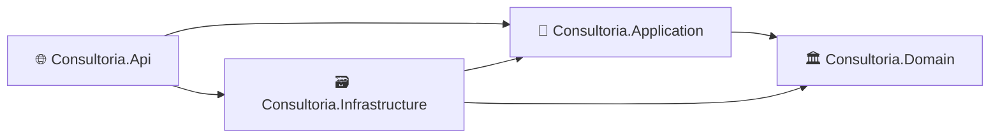
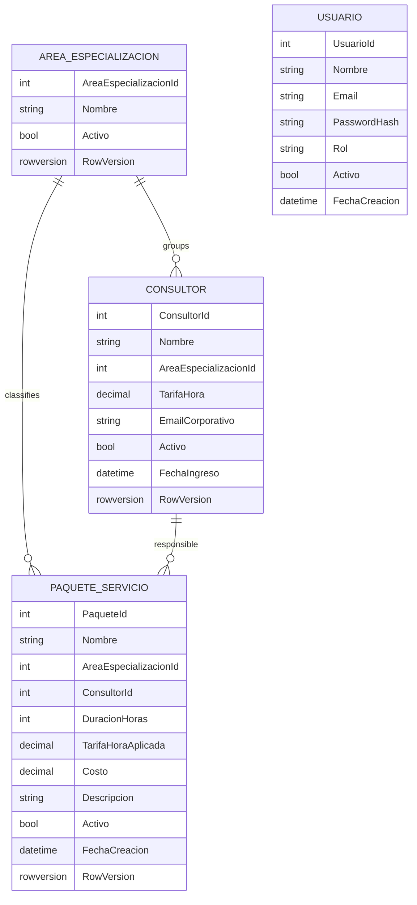
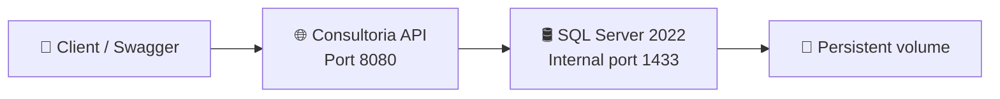

<div align="center">

# 💼 Consultoria API

### Enterprise backend for managing consultants, service packages, authentication, and administrative reports

<p>
  <a href="README.md">
    
  </a>
  <a href="README.es.md">
    
  </a>
</p>

<p>
  
  
  
  
  
  
</p>

</div>

---

## ⭐ Middle-level engineering highlights

> The most relevant technical capabilities are placed first so recruiters and reviewers can immediately identify the engineering practices demonstrated by the project.

<table>
  <tr>
    <td width="50%" valign="top">
      <ul>
        <li>✅ Clean Architecture with strict dependency direction</li>
        <li>✅ Domain entities with encapsulated business behavior</li>
        <li>✅ JWT authentication and role-based authorization</li>
        <li>✅ FluentValidation and global ProblemDetails error handling</li>
        <li>✅ EF Core migrations, configurations, projections, and repositories</li>
        <li>✅ Optimistic concurrency with SQL Server <code>rowversion</code></li>
      </ul>
    </td>
    <td width="50%" valign="top">
      <ul>
        <li>✅ Unit tests for domain and application services</li>
        <li>✅ Integration tests with WebApplicationFactory and Testcontainers</li>
        <li>✅ Isolated SQL Server database for the Testing environment</li>
        <li>✅ Docker multi-stage build and Docker Compose orchestration</li>
        <li>✅ Liveness and readiness health checks</li>
        <li>✅ GitHub Actions CI for build, unit tests, and integration tests</li>
      </ul>
    </td>
  </tr>
</table>

### Technologies demonstrated

`C#` · `.NET 10` · `ASP.NET Core Web API` · `Entity Framework Core` · `SQL Server 2022` · `JWT Bearer` · `FluentValidation` · `xUnit` · `Moq` · `WebApplicationFactory` · `Testcontainers` · `Docker` · `Docker Compose` · `GitHub Actions` · `OpenAPI / Swagger`

---

## 👋 About the project

**Consultoria API** is a REST API designed for the administration of a consulting company.

It manages specialization areas, consultants, service packages, users, role-based authentication, and administrative reports. The project was built as a professional portfolio project to demonstrate backend engineering practices used in business applications: separation of concerns, business rules, security, database consistency, automated testing, containerization, and continuous integration.

<table>
  <tr>
    <td width="50%">
      <h3>🎯 Technical focus</h3>
      <ul>
        <li>REST API design</li>
        <li>Clean Architecture</li>
        <li>Security with JWT</li>
        <li>Relational persistence</li>
        <li>Automated testing</li>
        <li>Containerized environments</li>
      </ul>
    </td>
    <td width="50%">
      <h3>🏢 Business focus</h3>
      <ul>
        <li>Consultant administration</li>
        <li>Hourly rates</li>
        <li>Automatically calculated services</li>
        <li>Active and inactive state management</li>
        <li>Billing and operational reports</li>
        <li>Historical rate preservation</li>
      </ul>
    </td>
  </tr>
</table>

---

## 🧰 Technology stack

| Area | Technology | Usage |
|---|---|---|
| ⚙️ Backend | **C# / .NET 10** | REST API, use cases, and business logic |
| 🌐 API | **ASP.NET Core Web API** | Controllers, middleware, authentication, and endpoints |
| 🗃️ Persistence | **Entity Framework Core** | Mapping, queries, migrations, and data access |
| 🛢️ Database | **SQL Server 2022** | Relational storage, constraints, indexes, and `rowversion` |
| 🔐 Security | **JWT Bearer** | Authentication and role-based authorization |
| ✅ Validation | **FluentValidation** | Request validation before executing use cases |
| 📚 Documentation | **OpenAPI / Swagger UI** | Interactive endpoint exploration |
| 🧩 Patterns | **Repository + Service Layer** | Separation between persistence and application logic |
| ⚡ Performance | **Pagination, projections, AsNoTracking, cache** | Efficient read operations and reports |
| 📝 Logging | **ILogger** | Structured logs for important operations |
| 🧪 Unit testing | **xUnit + Moq** | Domain and application service verification |
| 🔗 Integration testing | **WebApplicationFactory + Testcontainers** | HTTP flows with a real temporary SQL Server |
| 🐳 Containers | **Docker + Docker Compose** | Reproducible API and database environments |
| 🔄 Continuous Integration | **GitHub Actions** | Automated restore, build, and test execution |

---

## 🏛️ Architecture

The solution follows **Clean Architecture**, keeping business rules independent from ASP.NET Core, Entity Framework Core, SQL Server, and infrastructure details.



| Layer | Responsibility | Main elements |
|---|---|---|
| 🏛️ **Domain** | Independent business core | Entities, invariants, calculations, and behavior |
| 🧠 **Application** | Use cases and contracts | DTOs, interfaces, services, validators, and exceptions |
| 🗃️ **Infrastructure** | Technical implementation | EF Core, repositories, migrations, JWT, cache, hashing, and seeders |
| 🌐 **API** | HTTP exposure | Controllers, OpenAPI, middleware, authentication, and health checks |

---

## 🗂️ Project structure

```text
Consultoria/
├── .github/
│   └── workflows/
│       └── ci.yml
├── docker/
│   ├── Dockerfile
│   └── compose.yaml
├── src/
│   ├── Consultoria.Api/
│   ├── Consultoria.Application/
│   ├── Consultoria.Domain/
│   └── Consultoria.Infrastructure/
├── tests/
│   ├── Consultoria.UnitTests/
│   └── Consultoria.IntegrationTests/
├── .dockerignore
├── .env.example
├── .gitignore
├── Consultoria.slnx
├── README.md
└── README.es.md
```

### Dependency direction

```text
Domain
└── No project references

Application
└── Domain

Infrastructure
├── Application
└── Domain

API
├── Application
└── Infrastructure

IntegrationTests
├── API
├── Application
└── Infrastructure
```

---

## 🧩 Business model



---

## 🚀 Main features

| Module | Capabilities |
|---|---|
| 🔑 **Authentication** | Login, JWT generation, issuer/audience validation, and role authorization |
| 🏷️ **Specialization areas** | Create, read, update, deactivate, and reactivate |
| 👨‍💼 **Consultants** | Profile, area, rate, corporate email, active state, and reactivation rules |
| 📦 **Service packages** | Consultant assignment, automatic area and rate selection, cost calculation, and historical rate storage |
| 📊 **Reports** | Pagination, optional filters, sorting, aggregates, and temporary caching |
| 🔄 **Concurrency** | Protection against lost updates through SQL Server `rowversion` |
| ❤️ **Health checks** | Separate liveness and readiness endpoints |
| 🧪 **Testing** | Unit and integration tests with an isolated real database |
| 🐳 **Infrastructure** | API and SQL Server as independent containers |
| ⚙️ **CI** | Automatic validation on every push and pull request |

---

## 🧠 Important business rules

### 👨‍💼 Consultants

- Corporate email must be unique.
- The assigned specialization area must exist and be active.
- The hourly rate must be within the configured valid range.
- Records are deactivated logically instead of being physically deleted.
- An inactive consultant can only be reactivated when the assigned area is active.

### 📦 Service packages

The client sends only the editable business data:

```json
{
  "nombre": "Financial administration for small businesses",
  "consultorId": 2,
  "duracionHoras": 10,
  "descripcion": "Financial best-practices workshop."
}
```

The backend determines:

| Value | Rule |
|---|---|
| 🏷️ Area | Obtained from the selected consultant |
| 💵 Applied rate | Obtained from the consultant's current rate |
| 🧮 Cost | Calculated as duration multiplied by applied rate |

```text
Cost = DurationHours × AppliedHourlyRate
```

`TarifaHoraAplicada` is stored in the package to preserve the historical rate even if the consultant's current rate changes later.

A package can only be reactivated when its consultant and related area are active and consistent.

---

## 🔄 Optimistic concurrency

The update DTOs include a `RowVersion` received from the previous GET response.

```text
GET resource
→ receive RowVersion V1
→ another user updates the same row
→ SQL Server generates V2
→ PUT with V1
→ 409 Conflict
```

This prevents one user from silently overwriting another user's changes.

---

## 🔐 Security and authorization

| Role | Main permissions |
|---|---|
| 🛡️ **Admin** | Read and manage areas, consultants, and packages |
| 👤 **User** | Read information and reports |

Security capabilities:

- Signed JWT access tokens.
- Issuer and audience validation.
- Configurable expiration.
- Identity and role claims.
- Hashed passwords.
- `401 Unauthorized` for missing or invalid authentication.
- `403 Forbidden` for authenticated users without required permissions.
- Environment variables and user secrets for sensitive configuration.

---

## 🌐 Main endpoints

<details>
<summary><strong>🔑 Authentication</strong></summary>

| Method | Endpoint | Access |
|---|---|---|
| `POST` | `/api/v1/auth/login` | Public |

</details>

<details>
<summary><strong>🏷️ Specialization areas</strong></summary>

| Method | Endpoint | Access |
|---|---|---|
| `POST` | `/api/v1/areas-especializacion` | Admin |
| `GET` | `/api/v1/areas-especializacion` | Admin / User |
| `GET` | `/api/v1/areas-especializacion/{id}` | Admin / User |
| `PUT` | `/api/v1/areas-especializacion/{id}` | Admin |
| `DELETE` | `/api/v1/areas-especializacion/{id}` | Admin |
| `PATCH` | `/api/v1/areas-especializacion/{id}/activar` | Admin |

</details>

<details>
<summary><strong>👨‍💼 Consultants</strong></summary>

| Method | Endpoint | Access |
|---|---|---|
| `POST` | `/api/v1/consultores` | Admin |
| `GET` | `/api/v1/consultores` | Admin / User |
| `GET` | `/api/v1/consultores/{id}` | Admin / User |
| `PUT` | `/api/v1/consultores/{id}` | Admin |
| `DELETE` | `/api/v1/consultores/{id}` | Admin |
| `PATCH` | `/api/v1/consultores/{id}/activar` | Admin |

</details>

<details>
<summary><strong>📦 Service packages</strong></summary>

| Method | Endpoint | Access |
|---|---|---|
| `POST` | `/api/v1/paquetes` | Admin |
| `GET` | `/api/v1/paquetes` | Admin / User |
| `GET` | `/api/v1/paquetes/{id}` | Admin / User |
| `PUT` | `/api/v1/paquetes/{id}` | Admin |
| `DELETE` | `/api/v1/paquetes/{id}` | Admin |
| `PATCH` | `/api/v1/paquetes/{id}/activar` | Admin |

</details>

<details>
<summary><strong>📊 Reports</strong></summary>

| Method | Endpoint | Access |
|---|---|---|
| `GET` | `/api/v1/reportes/paquetes-por-area` | Admin / User |
| `GET` | `/api/v1/reportes/consultores-top-facturacion` | Admin / User |

</details>

<details>
<summary><strong>❤️ Health checks</strong></summary>

| Method | Endpoint | Purpose |
|---|---|---|
| `GET` | `/health/live` | Confirms that the API process is alive |
| `GET` | `/health/ready` | Confirms that the API and SQL Server are ready |

</details>

---

## 📬 Response contract

### Successful response

```json
{
  "success": true,
  "message": "Operation completed successfully.",
  "data": {}
}
```

### Error handling

Errors are processed globally and returned using `ProblemDetails`.

| Code | Usage |
|---|---|
| `200` | Successful operation |
| `201` | Resource created |
| `400` | Invalid request or validation error |
| `401` | Invalid credentials or missing token |
| `403` | Authenticated user without permission |
| `404` | Resource not found |
| `409` | Duplicate data or optimistic concurrency conflict |
| `422` | Business rule violation |
| `500` | Unexpected error |

---

## 🧪 Automated testing

### Unit tests

The unit test project verifies domain entity behavior, business rules, duplicate validation, cost calculation, activation and deactivation, repository interactions, and authentication flows.

### Integration tests

Integration tests run the complete HTTP pipeline through `WebApplicationFactory`.

Testcontainers starts a temporary SQL Server container, applies EF Core migrations, executes seeders, runs the tests, and removes the container afterward.

Covered flows include:

- Missing JWT returns `401`.
- Invalid login returns `401`.
- Valid login generates a token.
- User role cannot execute Admin operations and receives `403`.
- Main business flow: create area, consultant, and package.
- Health endpoints return `Healthy`.
- An outdated `RowVersion` returns `409 Conflict`.

```text
dotnet test
```

The Testing database is isolated from the Development database.

---

## 🔄 Continuous Integration

The workflow is located at:

```text
.github/workflows/ci.yml
```

Every push and pull request executes:

```text
Restore dependencies
→ Build in Release
→ Run unit tests
→ Start temporary SQL Server with Testcontainers
→ Run integration tests
→ Upload TRX test results
```

---

## 🐳 Containers and environments



| Service | Responsibility |
|---|---|
| 🌐 **consultoria-api** | Runs the ASP.NET Core application |
| 🛢️ **consultoria-sqlserver** | Runs SQL Server 2022 |
| 💾 **consultoria_sql_data** | Preserves Development data between container recreations |

The Dockerfile uses a multi-stage build and executes the final application with a non-root user.

### Environments

```text
Development
└── API + persistent SQL Server through Docker Compose

Testing
└── API hosted by WebApplicationFactory
    └── Temporary SQL Server through Testcontainers
```

---

## ▶️ Quick start with Docker Compose

<details>
<summary><strong>Open setup instructions</strong></summary>

### Requirements

- Docker Desktop or Docker Engine.
- Docker Compose.
- Git.

### 1. Clone the repository

```bash
git clone <REPOSITORY_URL>
cd Consultoria
```

### 2. Create the environment file

PowerShell:

```powershell
Copy-Item .env.example .env
```

Linux, macOS, or Git Bash:

```bash
cp .env.example .env
```

Complete the required SQL Server, JWT, and demo user variables.

### 3. Validate the Compose configuration

```bash
docker compose --env-file .env -f docker/compose.yaml config
```

### 4. Build and start

```bash
docker compose --env-file .env -f docker/compose.yaml up -d --build
```

### 5. Check status

```bash
docker compose --env-file .env -f docker/compose.yaml ps
```

Expected:

```text
consultoria-api         Up (healthy)
consultoria-sqlserver   Up (healthy)
```

### 6. Open Swagger

```text
http://localhost:8080/swagger
```

### Useful commands

| Action | Command |
|---|---|
| View API logs | `docker compose --env-file .env -f docker/compose.yaml logs -f api` |
| Stop without deleting data | `docker compose --env-file .env -f docker/compose.yaml down` |
| Start without rebuilding | `docker compose --env-file .env -f docker/compose.yaml up -d` |
| Rebuild only the API | `docker compose --env-file .env -f docker/compose.yaml up -d --build api` |
| Delete containers and persistent data | `docker compose --env-file .env -f docker/compose.yaml down -v` |

</details>

---

## 🌱 Seed data

The Development and Testing environments can create initial data through an idempotent seeder:

- Demo Admin user.
- Demo User account.
- Specialization areas.
- Consultants.
- Service packages.

The seeder checks existing values before inserting, preventing duplicate records across application restarts.

> Demo passwords are configured through environment variables or test configuration and are not stored in the repository.

---

## ⚡ Performance-conscious data access

Implemented practices include:

- SQL-level pagination with `Skip` and `Take`.
- `AsNoTracking` for read-only queries.
- Direct projection from EF Core queries to DTOs.
- `CancellationToken` propagation.
- Temporary cache for repeated report queries.
- Unique indexes and relational constraints.
- Tracked entity queries only when an update will follow.

---

## 🛡️ Engineering practices

<table>
  <tr>
    <td width="50%" valign="top">
      <ul>
        <li>✅ Clean Architecture</li>
        <li>✅ Dependency injection</li>
        <li>✅ Repository Pattern</li>
        <li>✅ Service Layer</li>
        <li>✅ DTOs for input and output</li>
        <li>✅ Encapsulated domain entities</li>
        <li>✅ FluentValidation</li>
        <li>✅ Logical deletion and reactivation</li>
        <li>✅ Optimistic concurrency</li>
      </ul>
    </td>
    <td width="50%" valign="top">
      <ul>
        <li>✅ JWT and role authorization</li>
        <li>✅ Global exception handling</li>
        <li>✅ Structured logging</li>
        <li>✅ EF Core migrations and seeders</li>
        <li>✅ Unit and integration tests</li>
        <li>✅ Testcontainers database isolation</li>
        <li>✅ Health checks</li>
        <li>✅ Docker Compose</li>
        <li>✅ GitHub Actions CI</li>
      </ul>
    </td>
  </tr>
</table>

---

## 🧭 Relevant technical decisions

<details>
<summary><strong>Why Clean Architecture?</strong></summary>

To keep the business domain independent from ASP.NET Core, Entity Framework Core, and SQL Server.

</details>

<details>
<summary><strong>Why store TarifaHoraAplicada?</strong></summary>

A consultant's rate can change in the future. Storing the applied rate preserves the historical cost of an already-created package.

</details>

<details>
<summary><strong>Why optimistic concurrency?</strong></summary>

It prevents lost updates without locking records while users are editing them. Conflicts are detected only when an outdated version is submitted.

</details>

<details>
<summary><strong>Why Testcontainers?</strong></summary>

Integration tests run against a real SQL Server without modifying the Development database.

</details>

<details>
<summary><strong>Why Docker Compose?</strong></summary>

It provides a reproducible Development environment with an isolated API, SQL Server service, startup health checks, and persistent storage.

</details>

---

## 🗺️ Technical milestones

| Milestone | Scope | Status |
|---|---|---|
| Foundation | API, Clean Architecture, authentication, CRUD, reports, SQL Server | ✅ Implemented |
| Business rules | Derived package area/rate, cost calculation, logical deletion | ✅ Implemented |
| Recovery flows | Reactivation of areas, consultants, and packages | ✅ Implemented |
| Quality | Unit tests, integration tests, and Testcontainers | ✅ Implemented |
| Operations | Docker Compose, health checks, and GitHub Actions CI | ✅ Implemented |
| Data consistency | Optimistic concurrency with `RowVersion` | ✅ Implemented |
| Observability | Correlation ID, distributed traces, and metrics | 🟡 Planned |
| User interface | Administrative frontend | ⚪ Future |

---

## 🔭 Planned improvements

- 🔎 Correlation ID for request tracing.
- 📈 OpenTelemetry metrics and traces.
- 🖥️ Administrative web interface.
- 🔐 Refresh tokens.
- 📦 Docker image publication.
- 🚀 Production deployment pipeline.
- 📊 Additional performance analysis with production-like data volumes.

---

<div align="center">

## 👨‍💻 Author

### Diego Esaú Hernández

**Software Engineer · Full Stack .NET Developer**

📍 El Salvador

<br>

<em>Portfolio project created to demonstrate enterprise backend development, architecture, security, testing, database consistency, containerization, and continuous integration.</em>

</div>
