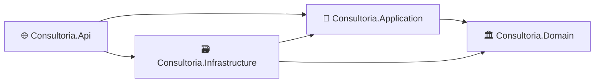
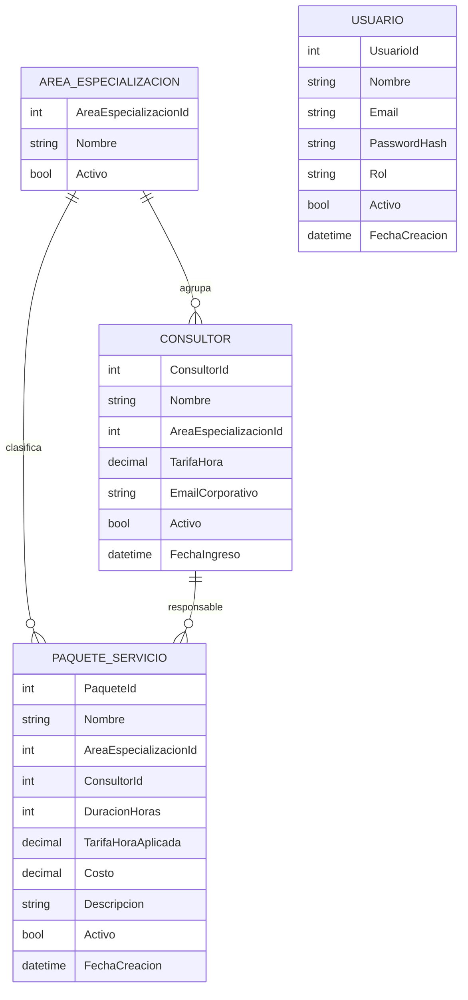
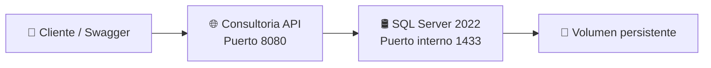

<div align="center">

# 💼 Consultoria API

### Backend empresarial para gestión de consultores, servicios y reportes

<p>
  Proyecto de portafolio desarrollado con <strong>.NET 10</strong>, <strong>Clean Architecture</strong>,
  <strong>Entity Framework Core</strong>, <strong>SQL Server</strong>, <strong>JWT</strong> y
  <strong>Docker Compose</strong>.
</p>

<p>
  
  
  
  
  
  
</p>

</div>

---

## 👋 Sobre el proyecto

**Consultoria API** es una API REST orientada a la administración de una empresa de consultoría.

El sistema permite gestionar áreas de especialización, consultores, paquetes de servicio, autenticación por roles y reportes administrativos. El objetivo principal del proyecto es demostrar experiencia práctica en el diseño de soluciones backend empresariales, aplicando separación de responsabilidades, reglas de negocio, seguridad y despliegue mediante contenedores.

<table>
  <tr>
    <td width="50%">
      <h3>🎯 Enfoque técnico</h3>
      <ul>
        <li>Diseño de APIs REST</li>
        <li>Arquitectura limpia</li>
        <li>Seguridad con JWT</li>
        <li>Persistencia relacional</li>
        <li>Contenedores con Docker</li>
      </ul>
    </td>
    <td width="50%">
      <h3>🏢 Enfoque de negocio</h3>
      <ul>
        <li>Administración de consultores</li>
        <li>Tarifas por hora</li>
        <li>Servicios calculados automáticamente</li>
        <li>Control de estados activos e inactivos</li>
        <li>Reportes de facturación</li>
      </ul>
    </td>
  </tr>
</table>

---

## ✨ ¿Qué demuestra este proyecto?

<table>
  <tr>
    <td align="center" width="25%">
      <h3>🏗️</h3>
      <strong>Arquitectura</strong>
      <p>Separación clara entre dominio, aplicación, infraestructura y API.</p>
    </td>
    <td align="center" width="25%">
      <h3>🔐</h3>
      <strong>Seguridad</strong>
      <p>Autenticación JWT y autorización basada en roles.</p>
    </td>
    <td align="center" width="25%">
      <h3>🧠</h3>
      <strong>Negocio</strong>
      <p>Reglas encapsuladas en servicios y entidades de dominio.</p>
    </td>
    <td align="center" width="25%">
      <h3>🐳</h3>
      <strong>Despliegue</strong>
      <p>API y SQL Server ejecutándose mediante Docker Compose.</p>
    </td>
  </tr>
</table>

---

## 🧰 Stack tecnológico

<table>
  <thead>
    <tr>
      <th>Área</th>
      <th>Tecnología</th>
      <th>Uso dentro del proyecto</th>
    </tr>
  </thead>
  <tbody>
    <tr>
      <td>⚙️ Backend</td>
      <td><strong>C# / .NET 10</strong></td>
      <td>Desarrollo de la API REST y reglas de negocio.</td>
    </tr>
    <tr>
      <td>🌐 API</td>
      <td><strong>ASP.NET Core Web API</strong></td>
      <td>Controllers, middlewares, autenticación y endpoints.</td>
    </tr>
    <tr>
      <td>🗃️ Persistencia</td>
      <td><strong>Entity Framework Core</strong></td>
      <td>Mapeo, consultas, migraciones y acceso a datos.</td>
    </tr>
    <tr>
      <td>🛢️ Base de datos</td>
      <td><strong>SQL Server 2022</strong></td>
      <td>Almacenamiento relacional, índices y restricciones.</td>
    </tr>
    <tr>
      <td>🔐 Seguridad</td>
      <td><strong>JWT Bearer</strong></td>
      <td>Autenticación y control de acceso por roles.</td>
    </tr>
    <tr>
      <td>✅ Validaciones</td>
      <td><strong>FluentValidation</strong></td>
      <td>Validación de solicitudes antes de ejecutar casos de uso.</td>
    </tr>
    <tr>
      <td>📚 Documentación</td>
      <td><strong>OpenAPI / Swagger UI</strong></td>
      <td>Exploración y prueba interactiva de endpoints.</td>
    </tr>
    <tr>
      <td>🧩 Patrones</td>
      <td><strong>Repository + Service Layer</strong></td>
      <td>Separación entre acceso a datos y lógica de aplicación.</td>
    </tr>
    <tr>
      <td>⚡ Rendimiento</td>
      <td><strong>IMemoryCache</strong></td>
      <td>Caché temporal para consultas de reportes.</td>
    </tr>
    <tr>
      <td>📝 Observabilidad</td>
      <td><strong>ILogger</strong></td>
      <td>Logging estructurado de operaciones importantes.</td>
    </tr>
    <tr>
      <td>🐳 Contenedores</td>
      <td><strong>Docker + Docker Compose</strong></td>
      <td>Ejecución conjunta de API y SQL Server.</td>
    </tr>
  </tbody>
</table>

---

## 🏛️ Arquitectura

El proyecto utiliza **Clean Architecture** para mantener las reglas de negocio independientes de frameworks, base de datos y detalles de infraestructura.



<table>
  <thead>
    <tr>
      <th>Capa</th>
      <th>Responsabilidad</th>
      <th>Elementos principales</th>
    </tr>
  </thead>
  <tbody>
    <tr>
      <td>🏛️ <strong>Domain</strong></td>
      <td>Núcleo de negocio independiente.</td>
      <td>Entidades, invariantes, cálculos y comportamiento.</td>
    </tr>
    <tr>
      <td>🧠 <strong>Application</strong></td>
      <td>Casos de uso y contratos.</td>
      <td>DTOs, interfaces, servicios, validadores y excepciones.</td>
    </tr>
    <tr>
      <td>🗃️ <strong>Infrastructure</strong></td>
      <td>Detalles técnicos y persistencia.</td>
      <td>EF Core, repositorios, migraciones, JWT, caché y hashing.</td>
    </tr>
    <tr>
      <td>🌐 <strong>API</strong></td>
      <td>Exposición HTTP de la aplicación.</td>
      <td>Controllers, Swagger, middleware y configuración.</td>
    </tr>
  </tbody>
</table>

---

## 🗂️ Organización del código

```text
Consultoria/
├── docker/
│   ├── Dockerfile
│   └── compose.yaml
├── src/
│   ├── Consultoria.Api/
│   ├── Consultoria.Application/
│   ├── Consultoria.Domain/
│   └── Consultoria.Infrastructure/
├── .dockerignore
├── .env.example
├── .gitignore
├── Consultoria.slnx
└── README.md
```

---

## 🧩 Modelo de negocio



---

## 🚀 Funcionalidades principales

<table>
  <thead>
    <tr>
      <th>Módulo</th>
      <th>Capacidades</th>
    </tr>
  </thead>
  <tbody>
    <tr>
      <td>🔑 <strong>Autenticación</strong></td>
      <td>Inicio de sesión, generación de JWT y autorización por roles.</td>
    </tr>
    <tr>
      <td>🏷️ <strong>Áreas</strong></td>
      <td>Creación, consulta, actualización y desactivación lógica.</td>
    </tr>
    <tr>
      <td>👨‍💼 <strong>Consultores</strong></td>
      <td>Gestión de perfil, área, tarifa, correo y estado.</td>
    </tr>
    <tr>
      <td>📦 <strong>Paquetes</strong></td>
      <td>Asignación automática de área y cálculo de costo.</td>
    </tr>
    <tr>
      <td>📊 <strong>Reportes</strong></td>
      <td>Paginación, filtros, ordenamiento y datos agregados.</td>
    </tr>
    <tr>
      <td>🐳 <strong>Infraestructura</strong></td>
      <td>API y SQL Server levantados como servicios independientes.</td>
    </tr>
  </tbody>
</table>

---

## 🧠 Reglas de negocio destacadas

### 👨‍💼 Consultores

- El correo corporativo debe ser único.
- No se permite repetir la combinación de nombre y área.
- La tarifa por hora se valida dentro del rango permitido.
- El área asignada debe existir y encontrarse activa.
- La eliminación se maneja de manera lógica mediante la propiedad `Activo`.

### 📦 Paquetes de servicio

El cliente proporciona únicamente los datos necesarios:

```json
{
  "nombre": "Administración financiera para microempresas",
  "consultorId": 2,
  "duracionHoras": 10,
  "descripcion": "Taller de buenas prácticas financieras."
}
```

El backend determina automáticamente:

<table>
  <tr>
    <td>🏷️ Área</td>
    <td>Se obtiene desde el consultor seleccionado.</td>
  </tr>
  <tr>
    <td>💵 Tarifa aplicada</td>
    <td>Se obtiene desde la tarifa actual del consultor.</td>
  </tr>
  <tr>
    <td>🧮 Costo</td>
    <td>Se calcula multiplicando duración por tarifa.</td>
  </tr>
</table>

```text
Costo = DuracionHoras × TarifaHoraAplicada
```

Ejemplo real:

```text
10 horas × $45 = $450
```

La tarifa utilizada queda almacenada en `TarifaHoraAplicada`, preservando el valor histórico del paquete aunque la tarifa del consultor cambie posteriormente.

---

## 🔐 Seguridad y autorización

<table>
  <thead>
    <tr>
      <th>Rol</th>
      <th>Permisos principales</th>
    </tr>
  </thead>
  <tbody>
    <tr>
      <td>🛡️ <strong>Admin</strong></td>
      <td>Consulta y administración de áreas, consultores y paquetes.</td>
    </tr>
    <tr>
      <td>👤 <strong>User</strong></td>
      <td>Consulta de información y reportes.</td>
    </tr>
  </tbody>
</table>

La API utiliza:

- Tokens JWT firmados.
- Validación de emisor y audiencia.
- Expiración configurable.
- Claims de identidad y rol.
- Contraseñas almacenadas mediante hash.
- Respuestas `401 Unauthorized` y `403 Forbidden` según el caso.

---

## 🌐 Endpoints principales

<details>
<summary><strong>🔑 Autenticación</strong></summary>

<br>

| Método | Endpoint | Acceso |
|---|---|---|
| `POST` | `/api/v1/auth/login` | Público |

</details>

<details>
<summary><strong>🏷️ Áreas de especialización</strong></summary>

<br>

| Método | Endpoint | Acceso |
|---|---|---|
| `POST` | `/api/v1/areas-especializacion` | Admin |
| `GET` | `/api/v1/areas-especializacion` | Admin / User |
| `GET` | `/api/v1/areas-especializacion/{id}` | Admin / User |
| `PUT` | `/api/v1/areas-especializacion/{id}` | Admin |
| `DELETE` | `/api/v1/areas-especializacion/{id}` | Admin |

</details>

<details>
<summary><strong>👨‍💼 Consultores</strong></summary>

<br>

| Método | Endpoint | Acceso |
|---|---|---|
| `POST` | `/api/v1/consultores` | Admin |
| `GET` | `/api/v1/consultores` | Admin / User |
| `GET` | `/api/v1/consultores/{id}` | Admin / User |
| `PUT` | `/api/v1/consultores/{id}` | Admin |
| `DELETE` | `/api/v1/consultores/{id}` | Admin |

</details>

<details>
<summary><strong>📦 Paquetes</strong></summary>

<br>

| Método | Endpoint | Acceso |
|---|---|---|
| `POST` | `/api/v1/paquetes` | Admin |
| `GET` | `/api/v1/paquetes` | Admin / User |
| `GET` | `/api/v1/paquetes/{id}` | Admin / User |
| `PUT` | `/api/v1/paquetes/{id}` | Admin |
| `DELETE` | `/api/v1/paquetes/{id}` | Admin |

</details>

<details>
<summary><strong>📊 Reportes</strong></summary>

<br>

| Método | Endpoint | Acceso |
|---|---|---|
| `GET` | `/api/v1/reportes/paquetes-por-area` | Admin / User |
| `GET` | `/api/v1/reportes/consultores-top-facturacion` | Admin / User |

</details>

---

## 📊 Reportes disponibles

<table>
  <thead>
    <tr>
      <th>Reporte</th>
      <th>Información presentada</th>
    </tr>
  </thead>
  <tbody>
    <tr>
      <td>📦 Paquetes por área</td>
      <td>Cantidad de paquetes, horas, costo total y costo promedio por área.</td>
    </tr>
    <tr>
      <td>🏆 Consultores por facturación</td>
      <td>Paquetes, horas trabajadas y total facturado por consultor.</td>
    </tr>
  </tbody>
</table>

Los reportes incluyen:

- Paginación.
- Filtros opcionales.
- Ordenamiento ascendente y descendente.
- Caché temporal para reducir consultas repetidas.

---

## 📬 Contrato de respuestas

### Respuesta exitosa

```json
{
  "success": true,
  "message": "Operación realizada correctamente.",
  "data": {}
}
```

### Manejo de errores

Los errores se procesan mediante un middleware global y utilizan `ProblemDetails`.

<table>
  <thead>
    <tr>
      <th>Código</th>
      <th>Uso</th>
    </tr>
  </thead>
  <tbody>
    <tr><td><code>200</code></td><td>Operación exitosa.</td></tr>
    <tr><td><code>201</code></td><td>Recurso creado.</td></tr>
    <tr><td><code>400</code></td><td>Solicitud o validación incorrecta.</td></tr>
    <tr><td><code>401</code></td><td>Credenciales inválidas o token ausente.</td></tr>
    <tr><td><code>403</code></td><td>Usuario autenticado sin permisos.</td></tr>
    <tr><td><code>404</code></td><td>Recurso no encontrado.</td></tr>
    <tr><td><code>409</code></td><td>Conflicto o registro duplicado.</td></tr>
    <tr><td><code>422</code></td><td>Regla de negocio no cumplida.</td></tr>
    <tr><td><code>500</code></td><td>Error inesperado.</td></tr>
  </tbody>
</table>

---

## 🐳 Contenedores e infraestructura

El entorno está dividido en dos servicios:



<table>
  <thead>
    <tr>
      <th>Servicio</th>
      <th>Responsabilidad</th>
    </tr>
  </thead>
  <tbody>
    <tr>
      <td>🌐 <strong>consultoria-api</strong></td>
      <td>Ejecuta la aplicación ASP.NET Core.</td>
    </tr>
    <tr>
      <td>🛢️ <strong>consultoria-sqlserver</strong></td>
      <td>Ejecuta SQL Server 2022 en un contenedor independiente.</td>
    </tr>
    <tr>
      <td>💾 <strong>consultoria_sql_data</strong></td>
      <td>Conserva los datos aunque los contenedores sean recreados.</td>
    </tr>
  </tbody>
</table>

El Dockerfile utiliza compilación en múltiples etapas para separar el SDK de compilación del runtime final y ejecutar la aplicación con una imagen más pequeña.

---

## 🛡️ Buenas prácticas implementadas

<table>
  <tr>
    <td width="50%">
      <ul>
        <li>✅ Clean Architecture</li>
        <li>✅ Inyección de dependencias</li>
        <li>✅ Repository Pattern</li>
        <li>✅ Service Layer</li>
        <li>✅ DTOs para entrada y salida</li>
        <li>✅ Entidades con estado encapsulado</li>
        <li>✅ Validaciones con FluentValidation</li>
        <li>✅ Eliminación lógica</li>
      </ul>
    </td>
    <td width="50%">
      <ul>
        <li>✅ JWT y autorización por roles</li>
        <li>✅ Manejo global de excepciones</li>
        <li>✅ Logging estructurado</li>
        <li>✅ Consultas con AsNoTracking</li>
        <li>✅ Proyecciones directas a DTOs</li>
        <li>✅ Migraciones con EF Core</li>
        <li>✅ Variables de entorno</li>
        <li>✅ Persistencia mediante volúmenes</li>
      </ul>
    </td>
  </tr>
</table>

---

## 🧭 Decisiones técnicas relevantes

<details>
<summary><strong>¿Por qué Clean Architecture?</strong></summary>

<br>

Para mantener el dominio independiente de ASP.NET Core, Entity Framework Core y SQL Server. Esto facilita el mantenimiento, las pruebas y la sustitución de detalles técnicos.

</details>

<details>
<summary><strong>¿Por qué guardar TarifaHoraAplicada?</strong></summary>

<br>

Porque la tarifa del consultor puede cambiar en el futuro. Guardar la tarifa utilizada evita modificar el valor histórico de paquetes ya creados.

</details>

<details>
<summary><strong>¿Por qué calcular el costo en el backend?</strong></summary>

<br>

Para evitar valores manipulados o inconsistentes enviados por el cliente. El backend es la fuente de verdad de las reglas de negocio.

</details>

<details>
<summary><strong>¿Por qué usar eliminación lógica?</strong></summary>

<br>

Para conservar trazabilidad y evitar eliminar información que puede estar relacionada con reportes o registros históricos.

</details>

<details>
<summary><strong>¿Por qué Docker Compose?</strong></summary>

<br>

Para levantar la API y la base de datos de forma reproducible, manteniendo cada servicio aislado y conservando la información mediante volúmenes.

</details>

---

## 🗺️ Evolución del proyecto

<table>
  <thead>
    <tr>
      <th>Versión</th>
      <th>Objetivo</th>
      <th>Estado</th>
    </tr>
  </thead>
  <tbody>
    <tr>
      <td><code>0.1.0</code></td>
      <td>API, autenticación, CRUD, reportes, SQL Server y Docker Compose.</td>
      <td>✅ Implementado</td>
    </tr>
    <tr>
      <td><code>0.2.0</code></td>
      <td>Reactivación de registros desactivados.</td>
      <td>🟡 Planificado</td>
    </tr>
    <tr>
      <td><code>0.3.0</code></td>
      <td>Actualizaciones parciales mediante PATCH.</td>
      <td>🟡 Planificado</td>
    </tr>
    <tr>
      <td><code>0.4.0</code></td>
      <td>Pruebas unitarias y de integración.</td>
      <td>🟡 Planificado</td>
    </tr>
    <tr>
      <td><code>1.0.0</code></td>
      <td>Primera versión estable.</td>
      <td>⚪ Futuro</td>
    </tr>
  </tbody>
</table>

---

## 🔭 Próximas mejoras

- 🔄 Reactivación de áreas, consultores y paquetes.
- 🩹 Actualizaciones parciales mediante `PATCH`.
- 🧪 Pruebas unitarias con xUnit.
- 🔗 Pruebas de integración para endpoints y autenticación.
- 📊 Mejoras en la documentación y filtros de reportes.
- ⚙️ CI/CD mediante GitHub Actions.
- ❤️ Health checks de API y base de datos.
- 🖥️ Interfaz administrativa.
- 🔐 Refresh tokens.
- 📦 Publicación de imágenes en un registro Docker.

---

<div align="center">

## 👨‍💻 Autor

### Diego Esaú Hernández

**Software Engineer · Full Stack .NET Developer**

📍 El Salvador

<br>

<em>Proyecto desarrollado como parte de mi portafolio profesional para demostrar conocimientos en backend empresarial, arquitectura, seguridad, persistencia y contenedores.</em>

</div>
